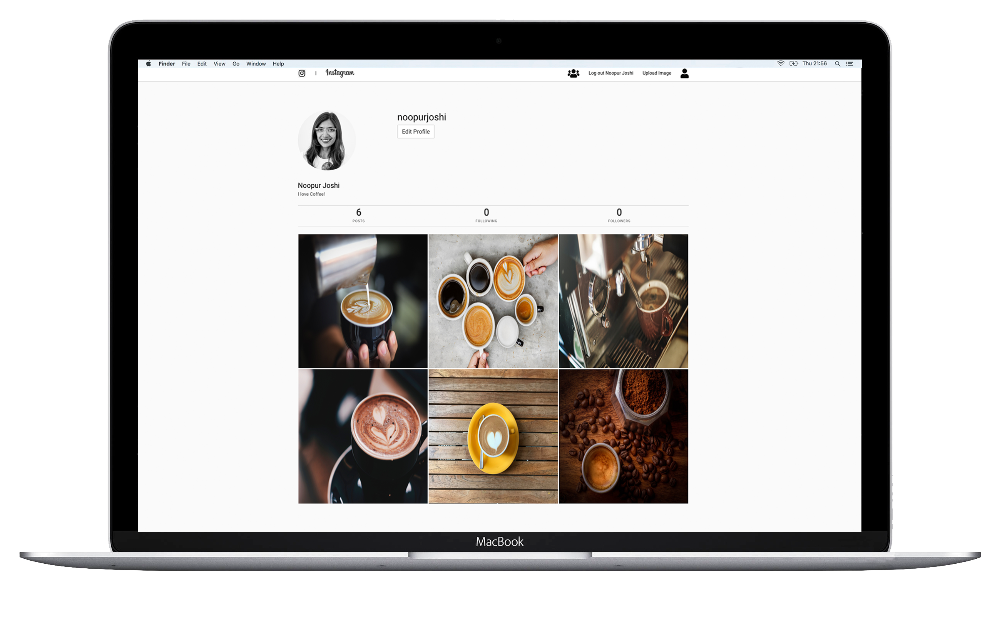
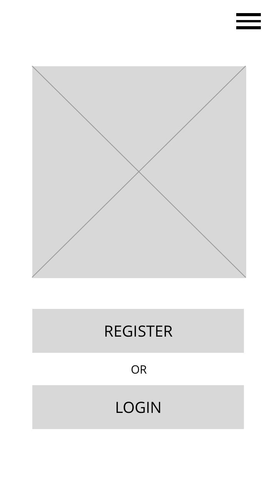

# Project 2 - Instagram Clone

Link to project - https://noops-instagram.herokuapp.com/

## Technical Requirements
- Have at least 2 models – one representing a user and one that represents the main resource of your app.
- Incude relationships - embedded or referenced. Make sure you take the time to consider the best approach before building out your models.
- The app should include authentication - with encrypted passwords & an authorization flow.
- Have complete RESTful routes for at least one of your resources with all CRUD actions.
- Include wireframes - that you designed before building the app.
- Have semantically clean HTML - you make sure you write HTML that makes structural sense rather than thinking about how it might look, which is the job of CSS.
- Be deployed online and accessible to the public.

## Technologies Used
- HTML5
- CSS3
- JavaScript
- Bulma CSS Framework
- Express.js
- Node.js
- EJS Template
- MongoDB
- GitHub
- Git

## Overview
For our second project, we had the option to either do a restaurant review site, blogging site, or an instagram clone. Instagram resonated with me the most, and I wanted to create a clone of it using technologies learnt during the week before. We had 6 days to complete the project.

## Approach Taken
I started the project using wireframes that were given to us as part of the project brief. I focused on bringing the app as close as possible to the wireframes first, and adding key features such as adding, editing and deleting images and comments, log in, registration and log out and finally viewing other user profiles.

## Wireframes
### Followers

### Home Page

### User Profile Page

### Login

### New Comment

### New Image

## Wins
- My biggest win would be to only allow users to delete their own comments and images.
- My second win was add authentication to creating and deleting sessions.

## Challenges
- My main challenge was the styling and getting used to Bulma CSS Framework. This project was the first time using Bulma on a larger scale. I planned to style the application to make it look and feel like Instagram as much as possible, however I felt pressed for time to complete it since I had only 6 days.

## Future Features
- Add a search bar feature to search for other users on the app
- Add functionality so users can follow and unfollow each other
- Incorporate FileStack to allow users to upload images from their phone/laptop
- Fix the Burger Navbar
- Complete the styling to make it fully mobile, tablet and desktop responsive
